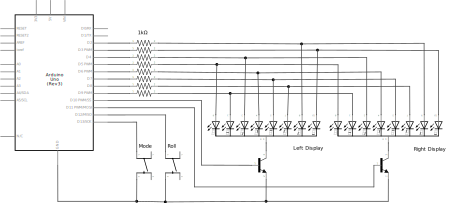

# 2d6

Two six-sided electronic dice.

One button to roll.

One button to pick how many dice. One or two. Great for [Machi Koro!](https://boardgamegeek.com/boardgame/143884/machi-koro)

Backgammon players get no guarantees on the number of doubles rolled.

Uses this [entropy library](https://sites.google.com/site/astudyofentropy/project-definition/timer-jitter-entropy-sources/entropy-library) for randomness.

## Demo

Click on the image below for a video demo:

## Schematic

## License

MIT
